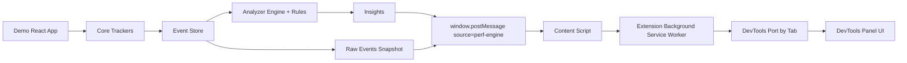

# Performance Engine: Project Overview and Complete Architecture

## 1) What You Are Building (Overall)

You are building a real-time frontend performance intelligence system.

The project captures runtime behavior from a web app (user interactions, network calls, and React renders), analyzes that telemetry for performance anti-patterns, and surfaces actionable insights inside a custom Chrome DevTools panel.

In short, this is an in-browser observability and diagnosis stack focused on UI performance causality.

## 2) Product Intent

The intent of this project is to answer questions like:

- Why did this interaction feel slow?
- Which component is re-rendering too much?
- Is network latency blocking UI updates?
- Are there wasted renders or state thrashing patterns?

Instead of only showing raw metrics, your system tries to explain root cause and suggest fixes.

## 3) High-Level Architecture

Your repository is organized into three main subsystems:

- core: Runtime tracking + analysis engine (TypeScript library)
- demo: React app that generates realistic UI activity and runs the core engine
- extension: Chrome extension that receives insight events and renders them in a DevTools panel

## 4) End-to-End Data Flow

## 5) Repository Structure and Responsibilities

### core/

This is your reusable engine package (published-ready TypeScript library setup).

- index.ts
  - Public exports for trackers, analyzer, store, and types
  - Session lifecycle via initPerfEngine(config)
  - Starts/stops trackers
  - Periodic analysis and insight dedupe window handling

- tracker/
  - eventTracker.ts
    - Captures UI DOM events (click, input, keydown, scroll, focus, etc.)
    - Normalizes target descriptor
  - networkTracker.ts
    - Patches fetch and XMLHttpRequest
    - Captures URL, method, duration, status
  - renderTracker.ts
    - Manual render instrumentation via trackRender(componentName, ...)
    - Global enable/disable flag
  - time.ts
    - Monotonic timestamp source (performance.now fallback)

- logger/
  - store.ts
    - Bounded in-memory circular store
    - Default max size 2000 events
    - Trims old events to avoid unbounded growth

- analyzer/
  - context.ts
    - Sorts events and builds interaction windows
    - Builds render chains based on temporal gaps
  - rules.ts
    - Rule-based diagnosis layer
    - Produces Insight objects with message, cause, possibleFix, confidence, impact
  - engine.ts
    - Runs rules over analysis context
    - Dedupes insights and merges overlapping ones
  - explain.ts
    - Formats human-readable explanation string

- types/
  - events.ts
    - Discriminated union for ui/render/network events
  - insights.ts
    - Insight schema, severity, impact metadata

### demo/

This is your simulation/testbed app (React + Vite + TypeScript).

- src/main.tsx
  - Initializes engine with all trackers enabled
  - Runs periodic analysis
  - Publishes INSIGHTS_UPDATE and EVENTS_UPDATE via window.postMessage

- src/App.tsx
  - Interactive inbox/task UI to generate user, render, and state activity
  - Calls trackRender("App") to feed render tracker
  - Includes filtering, toggles, repeated updates, and task actions that create realistic interaction traces

- vite.config.ts
  - Allows importing from parent folder so demo can use ../core

### extension/

This is your Chrome extension visualization layer.

- manifest.json (MV3)
  - Registers service worker background.js
  - Injects contentScript.js on all pages
  - Adds custom DevTools page

- contentScript.js
  - Listens to page window.postMessage events
  - Forwards perf-engine messages to extension runtime

- background.js
  - Maintains DevTools ports keyed by tabId
  - Routes incoming PERF_MESSAGE to correct DevTools panel instance

- devtools/devtools.js
  - Creates the custom DevTools panel

- devtools/panel.js + panel.html + panel.css
  - Renders issue list, details, severity filtering, text search
  - Shows timeline of events around selected insight window

## 6) Analysis Rules Currently Implemented

Your core analyzer currently detects six issue classes:

1. interaction-induced-render-burst
2. keystroke-render-loop
3. interaction-render-latency
4. network-blocking-render
5. state-thrashing
6. wasted-render

Each rule emits structured Insight objects with:

- issueType
- severity (low/medium/high/critical)
- source (component or URL)
- message, cause, possibleFix
- confidence (0..1)
- impact estimate (estimatedDelayMs, optional renderCostMs)
- metadata (render count, windows, affected components, dedupe key)

## 7) Runtime Session Lifecycle

initPerfEngine(config) does the following:

1. Stops any existing active session
2. Clears previous in-memory events
3. Applies max event store size (if provided)
4. Starts selected trackers (UI/network/render)
5. Builds rule set (default plus custom, or fully replaced)
6. Runs periodic analyze/publish loop
7. Emits only fresh insights using dedupe time window logic
8. Exposes session controls:
   - analyzeNow()
   - getInsights()
   - getEvents()
   - stop()

## 8) Message Contracts Across App and Extension

Page-level messages posted from demo:

- source: perf-engine
- type: INSIGHTS_UPDATE or EVENTS_UPDATE
- payload: insight array or tracked event array
- timestamp: performance.now()

Extension transport wrapper:

- runtime message type: PERF_MESSAGE
- payload: original page message object

This creates a clean boundary between app runtime and extension runtime.

## 9) What Makes This Architecture Strong

- Clear separation of concerns
  - Capture, store, analyze, visualize are split cleanly
- Rule-driven analyzer design
  - Easy to add/replace rules without changing trackers
- Typed event and insight contracts
  - Strong TypeScript boundaries reduce integration mistakes
- DevTools integration by tab routing
  - Correctly isolates messages per inspected tab
- Practical diagnosis output
  - Not just telemetry, but cause + fix suggestions

## 10) Current Gaps / Next Evolution Opportunities

- Core package currently has no automated tests in repository
- Render instrumentation is manual (trackRender calls), not automatic React commit hook integration
- Extension permissions are broad (<all_urls>) and could be tightened later
- Persistence is in-memory only (no historical session storage)
- No server/backend yet, so this is local runtime intelligence rather than fleet analytics

## 11) How to Think About This Project in One Sentence

You are building a frontend performance diagnosis platform that captures browser runtime events, infers likely performance bottlenecks through rule-based causal analysis, and presents actionable insights directly inside Chrome DevTools.
